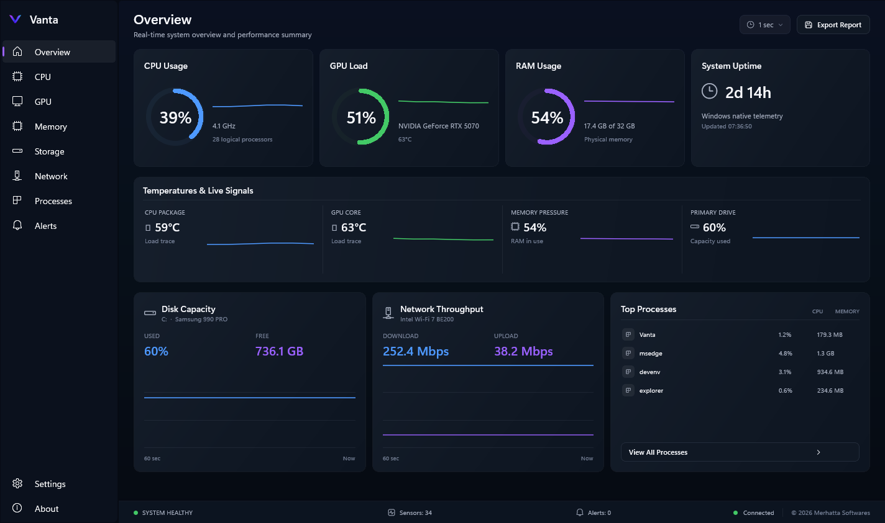
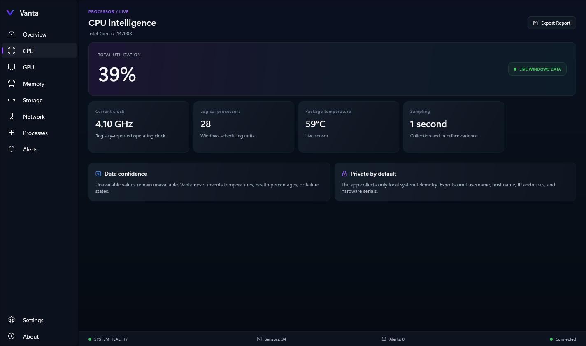
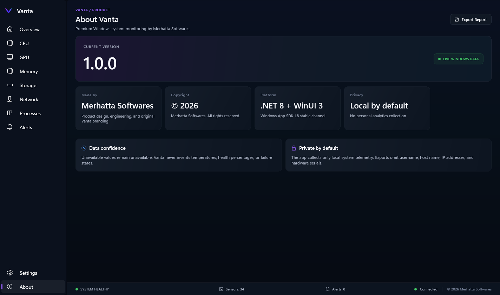

# Vanta

**Premium native Windows system monitoring, performance analytics, and hardware intelligence.**

Vanta is a C# desktop application built with .NET 8, WinUI 3, and Windows App SDK 1.8. It combines real-time native Windows telemetry with a compact, premium dashboard designed for clear, honest system insight.

Made by **Merhatta Softwares**. Copyright © 2026 Merhatta Softwares. All rights reserved.



## Highlights

- Native C# and WinUI 3 desktop experience
- Live CPU, memory, storage, network, process, GPU identity, and uptime telemetry
- Circular utilization gauges and rolling performance traces
- Focused CPU, GPU, memory, storage, network, process, alerts, settings, and About views
- Conservative health assessment without fabricated sensor values
- Privacy-safe JSON diagnostic report export
- Standard-user operation with no permanent administrator requirement
- Deterministic demo provider for interface development
- Automated MSTest coverage for telemetry, monitoring, simulation, and formatting
- Self-contained Windows x64 release option

## Screenshots

### System overview


### CPU intelligence



### About and ownership



## Requirements

### To run a release

- Windows 10 version 2004 / build 19041 or later
- 64-bit Windows installation

The release package is self-contained and does not require users to install the .NET runtime separately.

### To build from source

- Windows 10 or Windows 11
- .NET SDK 9.0.306 or a compatible 9.0 patch selected by `global.json`
- Visual Studio 2022 with WinUI/C# tooling is optional; the .NET CLI is sufficient

## Quick start

```powershell
dotnet restore Vanta.sln
dotnet build Vanta.sln -c Debug -p:Platform=x64 --no-restore
dotnet run --project Vanta\Vanta.csproj -c Debug -p:Platform=x64 --no-build
```

The repository also includes an unpackaged launch profile:

```powershell
dotnet run --project Vanta\Vanta.csproj --launch-profile "Vanta (Unpackaged)"
```

## Demo mode

Use deterministic simulated hardware data when developing the interface:

```powershell
$env:VANTA_DEMO = "1"
dotnet run --project Vanta\Vanta.csproj --launch-profile "Vanta (Unpackaged)"
```

Remove the variable to return to native Windows telemetry:

```powershell
Remove-Item Env:VANTA_DEMO -ErrorAction SilentlyContinue
```

## Tests

```powershell
dotnet test Vanta.Tests\Vanta.Tests.csproj -c Debug -p:Platform=x64
```

The current suite contains six tests covering the native provider, simulated provider, monitoring service, and dashboard formatting.

## Telemetry and sensor behavior

| Signal | Current source | Behavior |
| --- | --- | --- |
| CPU usage | Native Windows timing APIs | Live |
| CPU identity / clock | Windows registry and system information | Live when available |
| Memory pressure | `GlobalMemoryStatusEx` | Live |
| Fixed-drive capacity | Windows drive information | Live |
| Network throughput | Active network-interface counters | Live |
| Processes | .NET/Windows process APIs | Read-only live sample |
| Uptime | Native Windows uptime counter | Live |
| GPU identity | Windows adapter information | Live when exposed |
| GPU utilization / temperature | Optional provider boundary | Explicitly unavailable when unsupported |
| CPU temperature / fan RPM / SMART | Optional provider boundary | Explicitly unavailable when unsupported |

Vanta never invents temperatures, fan speeds, health percentages, or failure states. Unsupported signals remain visibly unavailable until a reliable provider is installed.

## Architecture

```text
Windows / simulated telemetry provider
                 ↓
          MonitoringService
                 ↓
         TelemetrySnapshot
                 ↓
        DashboardViewModel
                 ↓
             WinUI 3 UI
```

Collection, scheduling, domain models, presentation state, and XAML are separated so additional providers can be added without coupling hardware access to the interface. See [Architecture](docs/ARCHITECTURE.md) for details.

## Privacy and privilege

- Vanta runs as a normal user.
- Telemetry remains local to the computer.
- No personal analytics are collected.
- Exported reports omit username, host name, IP addresses, MAC addresses, and hardware serial numbers.
- The first release contains no process termination or privileged mutation actions.

See [Privacy](docs/PRIVACY.md) and [Security Policy](SECURITY.md).

## Creating a release

Build the verified self-contained WinUI output:

```powershell
dotnet restore Vanta.sln
dotnet build Vanta\Vanta.csproj -c Release -p:Platform=x64 --no-restore
```

The runnable files are generated under:

```text
Vanta\bin\x64\Release\net8.0-windows10.0.26100.0\win-x64\
```

Package the **contents of that directory**, including `Vanta.pri`, the compiled `.xbf` files, `Assets`, and `COPYRIGHT.txt`. See [Release Guide](docs/RELEASING.md).

Prebuilt binaries should be attached to a GitHub Release instead of committed to the repository.

## Repository structure

```text
Vanta/
├── Vanta/                  WinUI application
│   ├── Models/             Telemetry domain records
│   ├── Services/           Native/simulated providers and monitoring loop
│   ├── ViewModels/         Presentation state and formatting
│   ├── Themes/             Vanta design tokens and component styles
│   └── Assets/             Application icons and branding
├── Vanta.Tests/            MSTest project
├── docs/                   Architecture, privacy, release notes, screenshots
├── .github/workflows/      Windows CI build and test workflow
├── Vanta.sln
├── NuGet.Config
└── global.json
```

Additional project notes are available in the [design QA report](docs/DESIGN_QA.md) and [GitHub setup guide](docs/GITHUB_SETUP.md).

## Project status

Vanta 1.0.0 is a production-quality Phase 1 foundation. Planned extensions include optional temperature/fan providers, SMART/NVMe health, retained history, configurable alerts, service/startup inspection, and signed installers.

See [Changelog](CHANGELOG.md) for released changes.

## Contributing

Read [CONTRIBUTING.md](CONTRIBUTING.md) before proposing changes. Merhatta Softwares retains ownership of the project and decides which contributions may be accepted.

## Copyright and license

Vanta, its original source code, interface, branding, documentation, and original assets are copyright © 2026 **Merhatta Softwares**. All rights reserved.

This repository is source-available for review and authorized development. It is not an open-source license grant. See [LICENSE.txt](LICENSE.txt) and [Vanta/COPYRIGHT.txt](Vanta/COPYRIGHT.txt). Third-party components remain subject to their respective licenses.
